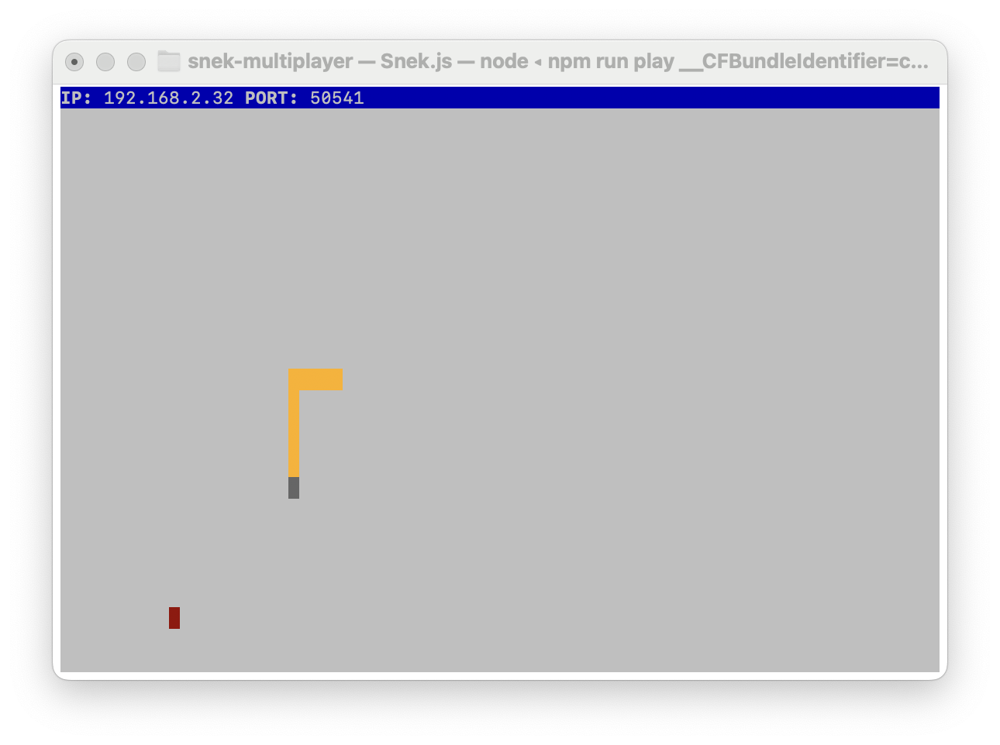

# Snake Client Project

Snake game is a very popular video game. It is a video game concept where the player maneuvers a dot and grows it by ‘eating’ pieces of food. As it moves and eats, it grows and the growing snake becomes an obstacle to smooth maneuvers. The goal is to grow it to become as big as possible without bumping into the side walls, or bumping into itself, upon which it dies.

This is simply a multiplayer take on the genre.

It works alongside the [snek-multiplayer](https://github.com/lighthouse-labs/snek-multiplayer) game server.

## Purpose

This project was made by [Neeha Baral](https://github.com/blueyellow7) for educational purposes as part of the [Lighthouse Labs](https://github.com/lighthouse-labs) Web Development Bootcamp.


## Final Product




## Instructions on how to run snake-client
1. Follow the installation instructions in the [snek-multiplayer README file](https://github.com/lighthouse-labs/snek-multiplayer/blob/master/README.md)
2. Open a new terminal window without closing snek-multiplayer
3. Run the following code in your new terminal window: 
```bash
git clone https://github.com/blueyellow7/snake-client.git
cd snake-client
node play.js
```

## Game Rules

Use 'WASD' keys to navigate the snake up, down, left, or right.

| Key   | Function               |
|-------|------------------------|
| `w`   | Moves snake up         |
| `a`   | Moves snake left    |
| `s`   | Moves snake down       |
| `d`   | Moves snake right      |

Use numbers keys to send messages.

| Key   | Message sent       |
|-------|--------------------|
| `1`   | thats hissterical! |
| `2`   | oh goodness snake! |
| `3`   |   /slithers away/  |
| `4`   |      :)))          |

Eat the red dots to make your snake longer.

Avoid crashing into the walls or your own tail, otherwise it's game over. 

Press CTRL + C to quit the game.


## Credits

This game is inspired by [Snek](https://store.steampowered.com/app/765590/Coop_SNEK_Online/) created by [Tania Rascia](https://www.taniarascia.com/). 
